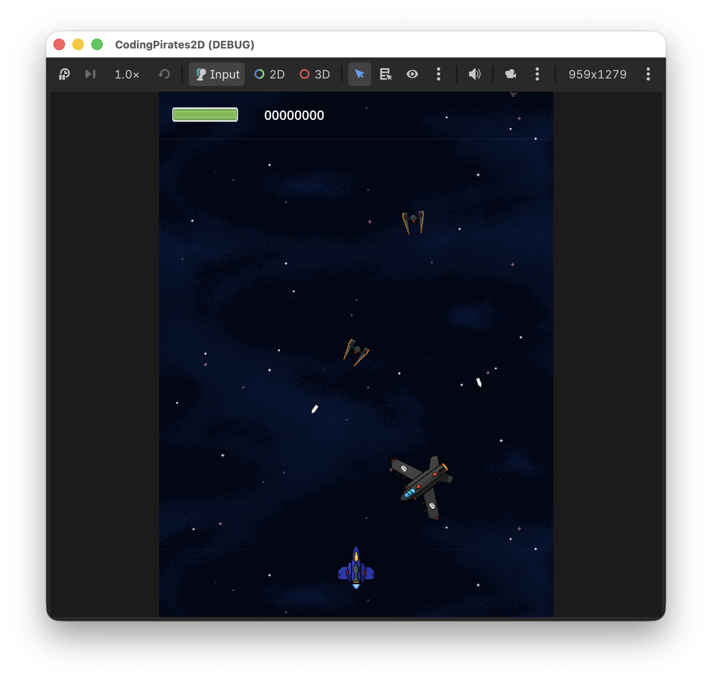

# Coding Pirates Godot 2D Space Shooter
Velkommen til vores første Godot-guideserie!

I denne guideserie skal vi lære at lave et klassisk 2D shoot'em'up spil som dem din mor og far smed spandevis af en-kroner efter på grillbaren da de var unge...spørg dem...det gjorde de garanteret.

Det kan måske virke kedeligt at lave et 2D spil når der er så mange fede 3D spil, men ligesom du heller ikke kunne løbe før du gik (igen, spørg dine forældre!) er vi nødt til at lære lidt om grundlæggende spiludvikling inden vi kaster os ud i 3D spil med lys og avanceret vektor matematik, derfor et 2D spil hvor der er _masser_ af sjove ting at lære.

Vi skal lære:

- Hvordan Godot virker
    - Hvad er noder og scener?
    - Hvad er scripts?
- Hvordan flytter vi noget rundt på skærmen?
- Hvordan laver vi en baggrund så det ser ud som om vi bevæger os?
- Hvordan skyder vi?
- Hvordan får vi nogle fjender på skærmen
- Og
- Så
- Videre

Det bliver sjovt, sommetider svært men sjovt og bare rolig, vi er her til at hjælpe.

Her er de levels vi skal igennem.

Du kan sætte hak ud for en level når du er færdig med den, så kan du se hvor langt du er nået.

## Levels
<ul class="level-progress">
<li>
    <input type="checkbox" data-progress-key="lessons/lesson01" aria-label="Mark Level 1, Sprites as complete" />
    <a href="lessons/lesson01">Level 1, Sprites</a>
</li>
<li>
    <input type="checkbox" data-progress-key="lessons/lesson02" aria-label="Mark Level 2, Animated Sprites as complete" />
    <a href="lessons/lesson02">Level 2, Animated Sprites</a>
</li>
<li>
    <input type="checkbox" data-progress-key="lessons/lesson03" aria-label="Mark Level 3, Parallax Background as complete" />
    <a href="lessons/lesson03">Level 3, Parallax Background</a>
</li>
<li>
    <input type="checkbox" data-progress-key="lessons/lesson04" aria-label="Mark Level 4, Player Weapons as complete" />
    <a href="lessons/lesson04">Level 4, Player Weapons</a>
</li>
<li>
    <input type="checkbox" data-progress-key="lessons/lesson05" aria-label="Mark Level 5, Enemies as complete" />
    <a href="lessons/lesson05">Level 5, Enemies</a>
</li>
<li>
    <input type="checkbox" data-progress-key="lessons/lesson06" aria-label="Mark Level 6, Exploding Enemies as complete" />
    <a href="lessons/lesson06">Level 6, Exploding Enemies</a>
</li>
<li>
    <input type="checkbox" data-progress-key="lessons/lesson07" aria-label="Mark Level 7, Exploding Player as complete" />
    <a href="lessons/lesson07">Level 7, Exploding Player</a>
</li>
<li>
    <input type="checkbox" data-progress-key="lessons/lesson08" aria-label="Mark Level 8, UI as complete" />
    <a href="lessons/lesson08">Level 8, UI</a>
</li>
</ul>

## Assets
[Assets kan downloades her](assets/gameassets/Godot2DAssets.zip)

Det er en zip-fil, så den skal du pakke ud. Sig til, hvis du skal have hjælp med det.

## Get Ready Player 1!
Når du er klar, klikker du bare på [Level 1, Sprites](lessons/lesson01).

